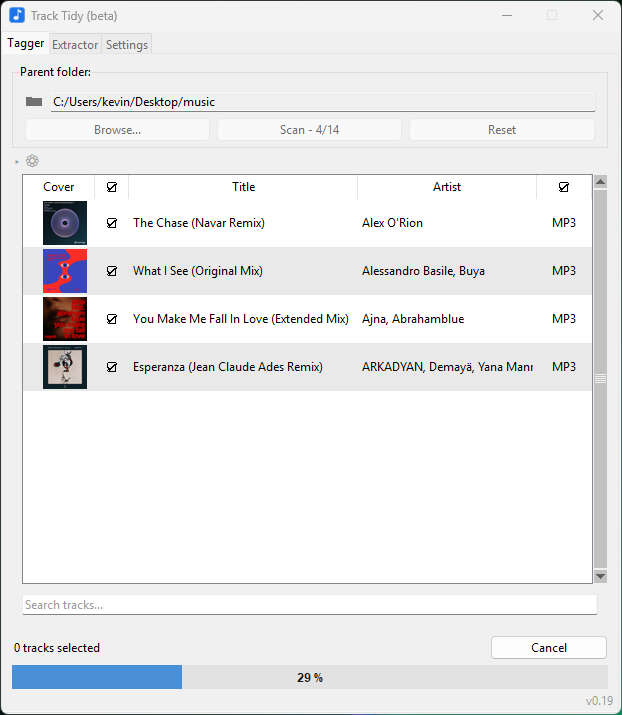

<p align="center">
  
</p>

<h1 align="center">Track Tidy</h1>

<p align="center">
  Free desktop app that auto-tags your DJ library: artist, title, and cover art -
  looked up automatically, no manual retagging.
</p>

<p align="center">
  <a href="https://github.com/k3rwan/track-tidy/releases/download/v0.19/Track-Tidy-Setup-v0.19.exe"></a>
  &nbsp;
  <a href="https://github.com/k3rwan/track-tidy/releases/download/v0.19/Track-Tidy-Setup-v0.19.dmg"></a>
</p>
<p align="center">
  <sub>v0.19 - see <a href="../../releases/latest">Releases</a> for older versions.</sub>
</p>

<p align="center">
  <a href="https://www.virustotal.com/gui/file/eff644203f1fef3f5cf115e5466a2e6e461322fd7ebd2ab49523c95022fecaee/detection"></a>
</p>

<p align="center">
  
</p>

## What it does

Point it at a folder and it:
- Looks up the correct **artist, title, and cover art** for each track (iTunes,
  Spotify, SoundCloud, and audio fingerprinting as a last resort for badly-named
  files).
- Writes the tags directly into the file - no more blank covers or
  "Track_Name (1).mp3" showing up in Rekordbox/Serato/etc.
- Optionally renames the file to a clean "Artist - Title" and converts WAV to
  AIFF (so cover art actually shows up for software that doesn't read it from
  WAV).
- Keeps a permanent history of every file it processes (browsable/restorable
  from Settings), so it never re-touches a file it's already tagged.
- Checks for updates on startup and can download/install them directly.
- Dark mode.

## Is this safe?

Fair question for a random installer from someone you don't know - completely
understand the hesitation. A few things that should help:
- Track Tidy talks to the services it needs to do its job - iTunes, Spotify,
  and SoundCloud (to look up artist/title/cover art), AcoustID (audio
  fingerprinting, only used as a last resort when the filename alone doesn't
  give enough to search with), and GitHub (checking for updates). It never
  touches files outside the folder you point it at, and never uploads your
  actual audio anywhere.
- It also sends the developer two small, anonymous-ish pings (your OS
  username, no other machine info) on install and after each scan (even a
  cancelled one), just so he knows the app is actually being used - this
  is disclosed in Settings' "View license & third-party notices" and
  isn't currently toggleable.
  Separately, the in-app "Report track" button (only when you press it) sends
  that one track's info (title/artist/filename + its cover) to help fix
  mismatches.
- The source code below is the real thing that gets built into the installer
  - nothing hidden.
- The Windows installer is scanned with
  [VirusTotal](https://www.virustotal.com/gui/file/eff644203f1fef3f5cf115e5466a2e6e461322fd7ebd2ab49523c95022fecaee/detection)
  on every release: **0/69** security vendors flag it.

## Install

**Windows**
1. Go to [Releases](../../releases/latest)
2. Download `Track-Tidy-Setup-v*.exe`
3. Run it and follow the prompts

**macOS** (Apple Silicon)
1. Go to [Releases](../../releases/latest)
2. Download `Track-Tidy-Setup-v*.dmg`
3. Open it and drag Track Tidy into Applications
4. First launch: right-click the app → Open (it's not notarized yet, so
   Gatekeeper will warn about an "unidentified developer" the first time)

## Feedback / bugs

Open an [Issue](../../issues), or use the in-app "Report track" button on a
specific track that got tagged wrong.

---

## For developers

### How it works

1. Choose a folder
2. Click **Scan** — each file appears as it's analyzed, with a suggested pre-checked "Apply" state
   - Unchecked: shows the file's *current* tags
   - Checked: shows the *suggested* tags (inferred from the filename + fetched cover)
3. Click a checkbox/cell to toggle it, or double-click Title/Artist to edit manually
4. Click **Apply**

### Project layout

| File | Purpose |
|---|---|
| `track_tidy.py` | Core logic: filename parsing, tag reading/writing, format conversion, cover search (see the module docstring for the full breakdown) |
| `interface.py` | Tkinter GUI on top of `track_tidy.py` |
| `Launch Track Tidy.bat` | Launches the app from the local `venv` |
| `build_all.bat` / `build_mac.sh` | Build a standalone app with PyInstaller (Windows/macOS) |
| `installer.iss` | Inno Setup script to package the Windows build into an installer |

### Setup

iTunes, SoundCloud, and AcoustID all work out of the box - no accounts or API
keys to set up. Spotify (off by default, toggle in Settings) and the shared
SoundCloud app both rely on the developer's own registered credentials, which
aren't included in this source - building from source gives you an app with
no shared defaults, same as an unconfigured user. See
`load_default_credentials()`'s docstring in `track_tidy.py` if you want to
supply your own via a local `default_credentials.json`.

It also relies on `ffmpeg`/`fpcalc` (format conversion, AcoustID
fingerprinting) being present next to the script - not included here, see
`find_ffmpeg()`/`find_fpcalc()`.

### Running from source

```bash
python -m venv venv
venv\Scripts\pip install -r requirements.txt
venv\Scripts\python interface.py
```

### License

GNU General Public License v2 or later (GPL-2.0-or-later) - see
[LICENSE](LICENSE). This is required by `mutagen`, a GPL-2.0-or-later
dependency imported directly into the app. The bundled `ffmpeg` (invoked as a
separate process, not linked in) is GPLv3. See
[THIRD-PARTY-NOTICES.md](licenses/THIRD-PARTY-NOTICES.md) for every
dependency's license.
